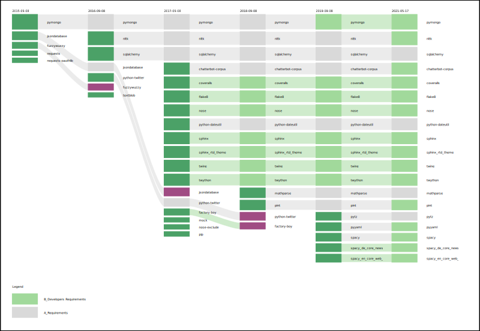

# PyCatFlow

This package is a visualization tool which allows the representation of temporal developments, based on categorical data.

## Install 

Download the repository install the package by running the setup.py install routine:

```python
python3 setup.py install
```

Alternatively you can download the folder and place the pycatflow subfolder in your project directory. 

**Requirements:** 
- the visualization and export is based on the drawSvg package
- the color palettes are from matplotlib


## Basic usage

The visualization library provides many functionalities for adjusting the visual output. It's simplest use is however as follows:

```Python
# Loading and parsing data:
data = pcf.read_file("sample_data.tsv", columns="versions", nodes="permissions", categories="app_review",
                     column_order="col_order")

# Generating the visualization
viz = pcf.visualize(data, 35, 10, width=1200, heigth=250, label_size=4, label_shortening="resize")
viz.savePng('sample_viz.png')
viz.saveSvg('sample_viz.svg')
viz
```

The code and sample data are provided in the example folder. Running it creates this visualization:




## Credits

PyCatFlow was conceptualized by Marcus Burkhardt and implemented by Herbert Natta (@herbertmn). It is inspired by the Rankflow visualization tool develped by Bernhard Rieder.

